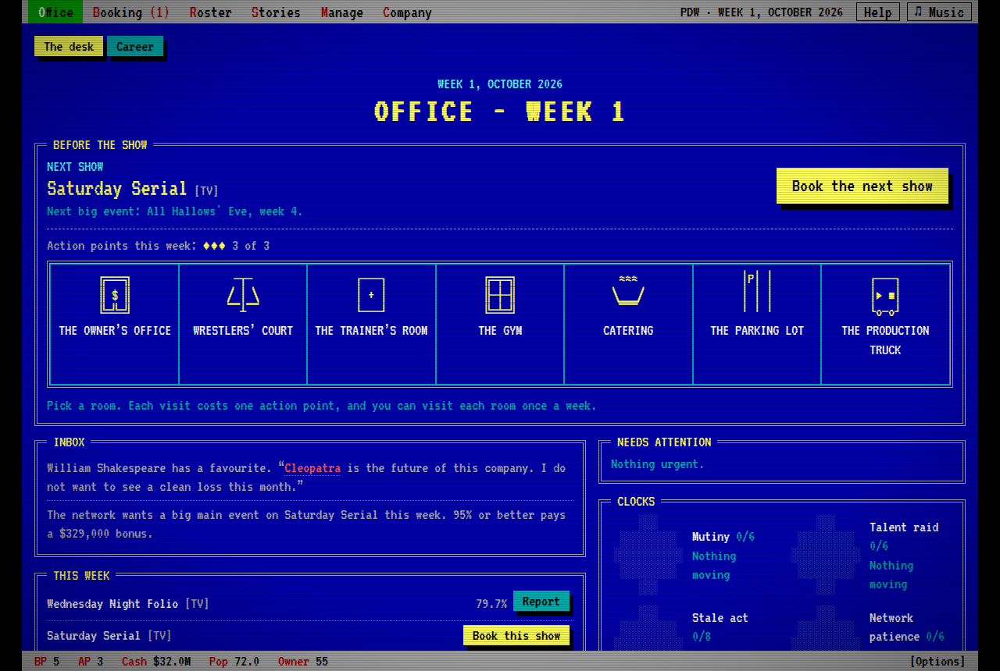
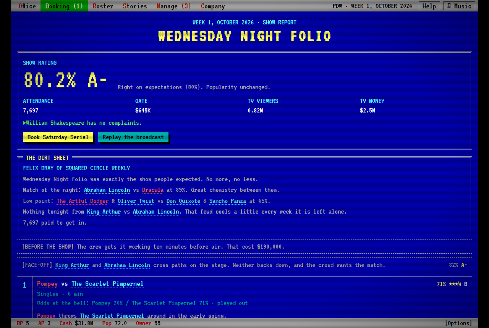

# EWF Wrestling Manager

A text-based wrestling booking sim in the Extreme Warfare tradition, drawn as a 1990s PC program.

You are the booker. You build the card; every match has odds, and the odds decide the winner unless you spend the booking power the owner grants you to call a finish. Shows play out as a broadcast you click through. Earn enough of the owner's trust and the company becomes yours.

**Status:** work in progress, version 0.38. Playable from start to finish; the feature list in `docs/` is still being built.

(Made by `tools/screenshots.js`.)

## Play it

Open `dist/index.html` in any browser. It is one self-contained file: no server, no downloads, no external assets.

## What is in the game

- **Nine promotions, each run a different way.** A publicly traded giant, a company for the diehards, a sport-first purist, a resilient underdog, a cash-burning startup, an outlaw, a lucha spectacle, a lucha traditionalist and an all-women company. The model changes what the crowd rewards, where the money comes from, who gets pushed, and who rivals hire and release. You can also found your own.
- **The default world is public domain:** history, myth and fiction published before 1929, set in the present day. Every roster is a universe package (a JSON file) that anyone can write and share: see `docs/universe-format.md`.
- **Booking:** match types, stipulations, feuds in four acts, angles, tournaments, rankings, stables, managers, pre-show incidents and mid-match chaos.
- **The locker room:** morale, egos, stress, body wear, mentors, wrestlers' court, house rules, action points to spend backstage before each show.
- **The business:** broadcast slot, production, risk level, tickets, advertising, sponsors, finances, rival promotions, trades, supershows and wars.
- **The long game:** title histories, record book, awards, hall of fame, ageing and rookie classes, achievements.
- **Pop-ups from any name:** select a wrestler, tag team or title anywhere to see its profile or lineage.
- **Screens and input:** one layout for desk, tablet, phone and TV; mouse, touch, keyboard, remote and gamepad.

## Build and test

    cd app && npm ci && cd ..   # installs the interface's build tools
    node build.js          # joins src/*.js into engine.js, bundles app/, writes dist/
    node test-uni.js universes/public_domain.json 60    # plays 60 weeks of every promotion with no interface
    NODE_PATH=<where playwright lives> node app/tests/journey.js    # plays real weeks in a browser on four screen sizes

## Layout

    src/*.js  -> engine.js    the simulation: no screen code, plain-JSON state, seeded
    app/                      the interface: Preact + TypeScript, bundled by esbuild into one script
    app/addons/               self-contained add-ons appended to the page (the soundtrack)
    universes/                universe packages; tools/ builds the default one
    desktop/                  Electron + steamworks.js wrapper (untested scaffold)
    docs/                     design document, universe format, backlog
    legacy/                   the interface this one replaced, kept for reference
    dist/                     the built game

Start with `docs/design.md`, then `app/DEV.md` for how screens are written.

## Rules the project keeps

- **Zero external assets.** The page fetches nothing. The interface is CSS, the font is embedded, portraits are drawn on a canvas by code.
- **Original content only.** Company models follow how real wrestling companies are run, but every promotion, wrestler and storyline name is invented or public domain. Real-world rosters are not part of this repository.

## Credits

The typeface is VT323 (SIL Open Font License 1.1), embedded in the built page.
